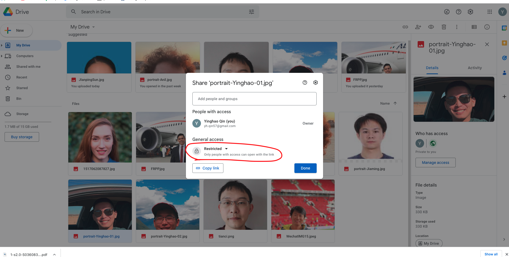
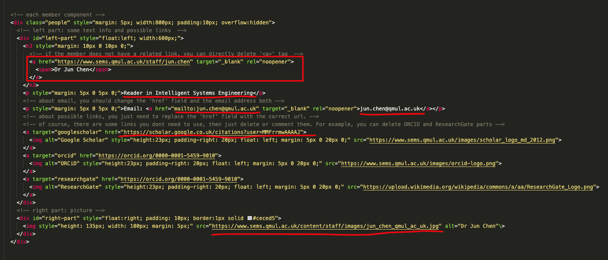

## Introduction

This is the website development note of __Intelligent Systems__. Due to the lack of content types that meet our requirements, we imeplement two small needs by editing the source code. Although the way to modify the source code is not recommended which might be incompatible with some scenarios, it is useful in the short term. 


Upgrade requirements 

- [x] publication style
- [x] our team: plus photos + possible link logo
- [x] Collaboration Part - Logos

- [x] add one block linking to our [Twitter account](https://twitter.com/IntelSysEngQMUL)


## Maintain Tips

* Prerequisites for website development - T4 Training is required to finish
  * login in QMplus
  * serach, enrol and complete the Module - "T4 Training"
* [University T4 Support](https://www.qmul.ac.uk/t4-support/content-type-directory/) (this might be helpful)

### 1) Publication style

* How?

  1. Prepare the paper citation using __APA__ format

     

  2. Login in the T4 system, and open the corresponding content type (`Tab - item` or `General Content`)

     

  3. Copy the paper citation and paste it

     

  4. Open source code and copy the new citation

     

     

  5. Modify the new citation according to the format below 

     * Before modify:

     ```html
     <ul>
       <!-- each "li" tag corresponds to a citation -->
       <li style="text-align: justify;"><span>Chen, J., Weiszer, M., Stewart, P., &amp; Shabani, M. (2015). Toward a more realistic, cost-effective, and greener ground movement through active routing&mdash;Part I: Optimal speed profile generation.&nbsp;</span><em>IEEE Transactions on Intelligent Transportation Systems</em><span>,&nbsp;</span><em>17</em><span>(5), 1196-1209.</span>
         <!-- The part below is needed to modified and added -->
         <!-- **************************** -->
         <div style="display:inline; margin-left: 10px;border-radius: 1em/5em;border: 1px solid; background-color: #0D3273;" >
           <a style="background-color: #fff;color: #444;border-top-left-radius: 4px; border-bottom-left-radius: 4px;"><span>DOI</span></a>
           <!-- you need to change the url and the DOI number -->
           <a style="border-top-right-radius: 4px; border-bottom-right-radius: 4px;background-color: #0D3273;color: #fff;" href="https://ieeexplore.ieee.org/document/7726055%C2%A0" target="_blank" rel="noopener"><span>10.1109/TITS.2016.2587619</span></a>
         </div>
         <!-- dont forget to change the date of the publication -->
         <br><p style="font-size: smaller;">31-10-2016</p>
         <!-- **************************** -->
       </li>
     
       <!-- paste the citation obtained in the above steps -->
     
       <!-- paste the citation obtained in the above steps -->
     </ul>
     ```

     * After modify:

     ```html
     <ul>
       <!-- each "li" tag corresponds to a citation -->
       <li style="text-align: justify;"><span>Chen, J., Weiszer, M., Stewart, P., &amp; Shabani, M. (2015). Toward a more realistic, cost-effective, and greener ground movement through active routing&mdash;Part I: Optimal speed profile generation.&nbsp;</span><em>IEEE Transactions on Intelligent Transportation Systems</em><span>,&nbsp;</span><em>17</em><span>(5), 1196-1209.</span>
         <!-- The part below is needed to modified and added -->
         <!-- **************************** -->
         <div style="display:inline; margin-left: 10px;border-radius: 1em/5em;border: 1px solid; background-color: #0D3273;" >
           <a style="background-color: #fff;color: #444;border-top-left-radius: 4px; border-bottom-left-radius: 4px;"><span>DOI</span></a>
           <!-- you need to change the url and the DOI number -->
           <a style="border-top-right-radius: 4px; border-bottom-right-radius: 4px;background-color: #0D3273;color: #fff;" href="https://ieeexplore.ieee.org/document/7726055%C2%A0" target="_blank" rel="noopener"><span>10.1109/TITS.2016.2587619</span></a>
         </div>
         <!-- dont forget to change the date of the publication -->
         <br><p style="font-size: smaller;">31-10-2016</p>
         <!-- **************************** -->
       </li>
     
       
       <!-- paste the citation obtained in the above steps and modify -->
       <li style="text-align: justify;"><span>Weiszer, M., Chen, J., &amp; Locatelli, G. (2015). An integrated optimisation approach to airport ground operations to foster sustainability in the aviation sector.&nbsp;</span><em>Applied Energy</em><span>,&nbsp;</span><em>157</em><span>, 567-582.</span>
         <div style="display:inline; margin-left: 10px;border-radius: 1em/5em;border: 1px solid; background-color: #0D3273;" >
           <a style="background-color: #fff;color: #444;border-top-left-radius: 4px; border-bottom-left-radius: 4px;"><span>DOI</span></a>
           <a style="border-top-right-radius: 4px; border-bottom-right-radius: 4px;background-color: #0D3273;color: #fff;" href="https://www.sciencedirect.com/science/article/pii/S0306261915004948" target="_blank" rel="noopener"><span>10.1016/j.apenergy.2015.04.039</span></a>
         </div>
         <br><p style="font-size: smaller;">31-11-2015</p>
       </li>
       <!-- paste the citation obtained in the above steps and modify -->
     </ul>
     ```

  6. Copy and paste the modified citiation already to source code area, and dont forget to click the button __save__

  7. Finally, save and approve

     

### 2)  Our team style

* There is a directory named by `our_team` in this project, so you can debug it at your local environment. When you finish that you can just upload the code to T4 system.

* How?

  1. Get the embed `url` of your portrait. A number of methods can be used to get the `url`, and here an example is given.

     * Upload the portrait to Google Drive

     * Remember to change the access from `Restricted` to `Anyone with the link`, and copy the Google Drive link

     * Transfer the obtained link above into a embed link using the free website - [example](https://www.labnol.org/embed/google/drive/)

       

       

  2. Replace the parts of the code following the comments, only some parts are needed to change (the red parts below)
  
     
  
     ```html
         <!-- each member component -->
         <div class="people" style="margin: 5px; width:800px; padding:10px; overflow:hidden">
           <!-- left part: some text info and possible links  -->
           <div id="left-part" style="float:left; width:600px;">
             <h3 style="margin: 10px 0 10px 0;">
               <!-- if the member does not have a related link, you can directly delete '<a>' tag  -->
               <a href="https://www.sems.qmul.ac.uk/staff/jun.chen" target="_blank" rel="noopener">
                 <span>Dr Jun Chen</span>
               </a>
             </h3>
             <p style="margin: 5px 0 5px 0;">Reader in Intelligent Systems Engineering</p>
             <!-- about email, you should change the 'href' field and the email address both -->
             <p style="margin: 5px 0 5px 0;">Email: <a href="mailto:jun.chen@qmul.ac.uk" target="_blank" rel="noopener">jun.chen@qmul.ac.uk</a></p>
             <!-- about possible links, you just need to replace the 'href' field with the correct url. --> 
             <!-- of course, there are some links you dont need to use, then just delete or comment them. For example, you can delete ORCID and ResearchGate parts -->
             <a target="googlescholar" href="https://scholar.google.co.uk/citations?user=MMFrrmwAAAAJ">
               
             </a>
             <a target="orcid" href="https://orcid.org/0000-0001-5459-9010">
               
             </a>
             <a target="researchgate" href="https://orcid.org/0000-0001-5459-9010">
               
             </a>
           </div>
           <!-- right part: picture -->
           <div id="right-part" style="float:right; padding: 10px; border:1px solid #ceced5">
             
           </div>
         </div>
     ```
  
  3. Login in T4 system, paste the modified code into the source code area, then `Save and approve`
  
     
